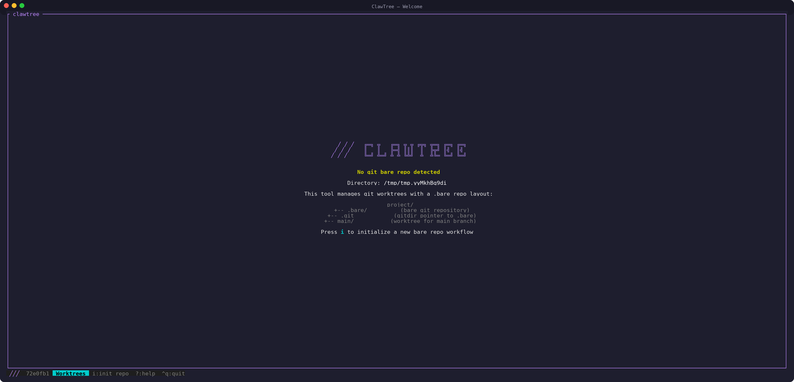
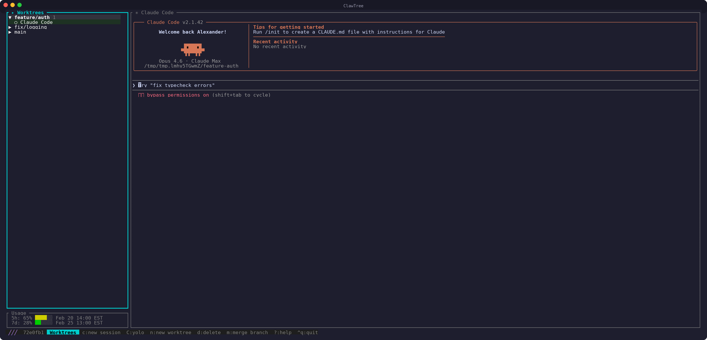
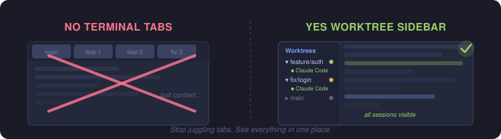
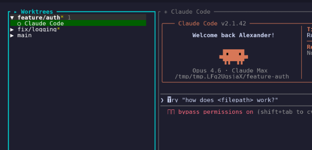
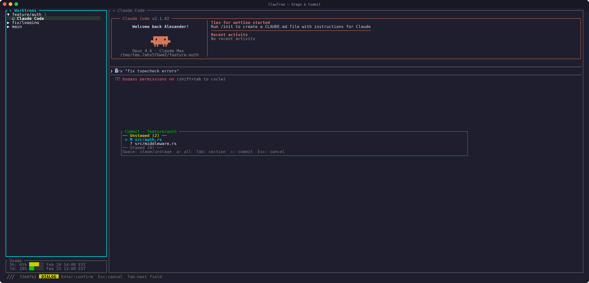
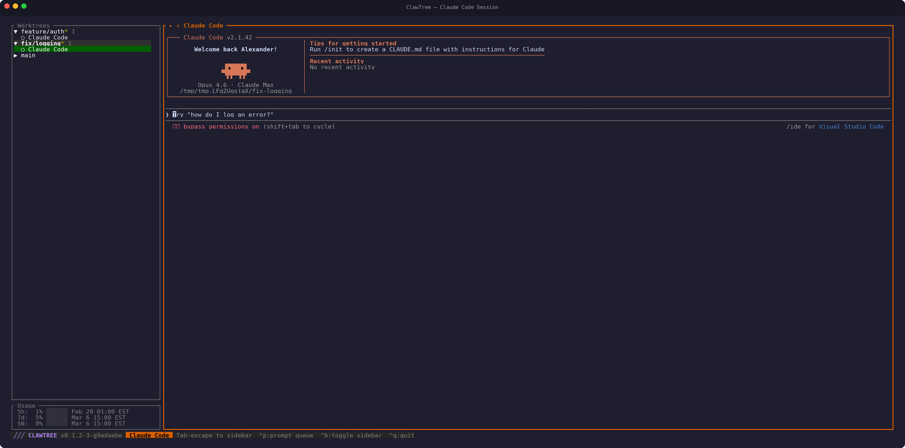
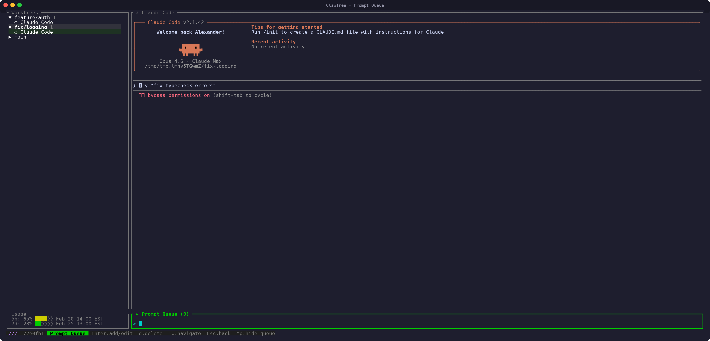
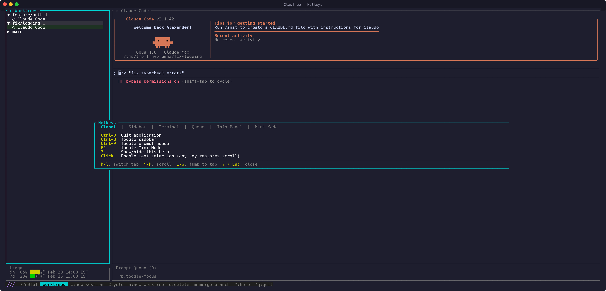

<div align="center">


<br>

**A terminal UI for managing git worktrees with integrated Claude Code sessions.**

[](https://github.com/Sorrer/ClawTree/releases/latest)
[](https://github.com/Sorrer/ClawTree/actions/workflows/release.yml)
[](https://www.rust-lang.org/)
[](#platform)
[](LICENSE)

</div>

---

One terminal, multiple Claude sessions — all visible at a glance.


>Behind the Project:
>
>As I have been embracing AI assisted programming, I found myself pushing parallel AI development to the extreme.
>With this, I am stuck cloning repositories for different feature paths, and context swapping between multiple terminal tabs. All in the goal to utilize multiple claude instances and contexts to their fullest extent.
>This has been a rough process that I've been trying to optimize, and this tool has solved my issue.
>You should now be granted with the power of multi-clauding with this toolset!


## Table of Contents

- [Install](#install)
- [Getting Started](#getting-started)
- [Features](#features)
  - [Worktree Management](#worktree-management)
  - [Git Operations](#git-operations)
  - [Claude Code Sessions](#claude-code-sessions)
  - [Prompt Queue](#prompt-queue)
  - [Mini Mode](#mini-mode)
  - [Terminal & UI](#terminal--ui)
- [Requirements](#requirements)
- [Future Goals](#future-goals)

## Install

```bash
curl -fsSL https://raw.githubusercontent.com/Sorrer/ClawTree/main/install.sh | bash
```

This downloads a pre-built binary for your platform and adds it to your PATH. Supports Linux (x86_64, aarch64) and macOS (Intel, Apple Silicon).

<details>
<summary><strong>Advanced install options</strong></summary>

Install from a **private repo** (requires [GitHub CLI](https://cli.github.com/) authenticated via `gh auth login`):

```bash
gh api repos/Sorrer/ClawTree/contents/install.sh \
  -H "Accept: application/vnd.github.raw" | GITHUB_TOKEN=$(gh auth token) bash
```

Install a specific version:

```bash
curl -fsSL https://raw.githubusercontent.com/Sorrer/ClawTree/main/install.sh | bash -s -- v0.1.2
```

Install to a custom directory:

```bash
CLAWTREE_INSTALL_DIR=/usr/local/bin curl -fsSL https://raw.githubusercontent.com/Sorrer/ClawTree/main/install.sh | bash
```

</details>

## Getting Started

> Make sure claude is installed and accessible

After installation, navigate to your project and run clawtree:

```bash
cd your-project
clawtree
```

If the directory does not contain a `.bare` repo layout, clawtree opens a **welcome screen** with setup options:

<p align="center">
  
</p>

From here you can:

- Press **`i`** to **initialize** a new bare repo workflow — creates the `.bare/` directory structure and your first worktree
- Press **`c`** to **convert** an existing regular git repo into the bare worktree layout (only shown when a `.git` directory is detected)

Once initialized, clawtree opens the main interface where you can browse your worktrees in the sidebar. Press **`n`** to create additional worktrees for new branches. To start a Claude Code session, press **`c`** for regular mode or **`C`** (Shift+C) for yolo mode (`--dangerously-skip-permissions`).

<p align="center">
  
</p>

## Features

### Worktree Management

<p align="center">
  
</p>

- Browse, create, and delete worktrees from a sidebar tree view
- Initialize new bare repos or clone from a remote URL
- Convert existing repos to the bare worktree layout
- Live git status updates per worktree

<p align="center">
  
</p>

### Git Operations
- Stage, unstage, and commit with AI-generated commit messages
- Branch merging with conflict detection and resolution (VS Code, JetBrains, Claude)
- Push to remote with automatic upstream setup

<p align="center">
  
</p>

### Claude Code Sessions
- Run multiple concurrent Claude Code sessions per worktree
- Sessions persist across restarts with automatic reconnection
- Session renaming and optional yolo mode (`--dangerously-skip-permissions`)

<p align="center">
  
</p>

### Prompt Queue

Queue up one-shot tasks for Claude to handle sequentially while you focus on other work — great for knocking out a batch of bug fixes or cleanup tasks after completing a big feature.

- Per-session queues that auto-send prompts when Claude is idle
- Add, edit, and delete queued prompts
- Queues persist across restarts

<p align="center">
  
</p>

### Mini Mode

- Compact agent management view with status badges (toggle with `F2`)
- Drilldown into a single agent's terminal full-screen
- Saved prompt templates for quick agent creation
- Auto-captured agent summaries when agents finish working

*Mini Mode is a work in progress and may change significantly.*

### Terminal & UI
- Keyboard-driven with vim-style navigation (`j`/`k`, `?` for help)
- Click-and-drag text selection with clipboard support
- URL detection — click to open, `u` to copy
- Scrollback browsing with scrollbar
- Auto update notifications

<p align="center">
  
</p>

### Platform
- Linux (x86_64, aarch64) and macOS (Intel, Apple Silicon)
- WSL integration: open Windows Terminal tabs with `w`/`W` keys
- Graceful signal handling (SIGINT, SIGTERM, SIGHUP) with guaranteed terminal restoration

## Requirements

| Dependency | Required | Purpose |
|---|---|---|
| **git** | Yes | Worktree management, staging, commits, merges |
| **claude** (Claude Code CLI) | Yes | AI assistant sessions spawned per worktree |
| **tmux** | Yes | Session persistence and reconnection across restarts |
| **wt.exe** | Optional | Windows Terminal tab integration (WSL only) |

<details>
<summary><strong>Development</strong></summary>

### Building from Source

Everything from the requirements above, plus Rust (edition 2021, 1.56+) and a C compiler.

```bash
./build.sh
# or manually:
cargo build --release
```

```bash
./run.sh
# or manually:
./target/release/clawtree
```

### Testing

Clawtree includes unit tests, integration tests for git operations, and an end-to-end test suite. CI runs automatically on push and PRs via GitHub Actions (unit/integration tests, E2E tests, and clippy lints).

```bash
# Run all tests
cargo test

# Run E2E tests (requires tmux and a release build)
cargo build --release
tests/e2e_test.sh
```

</details>

## Future Goals

- Enhance UI/UX to support **everyone's** workflows
- Support other agentic CLIs like Codex and Gemini CLI
