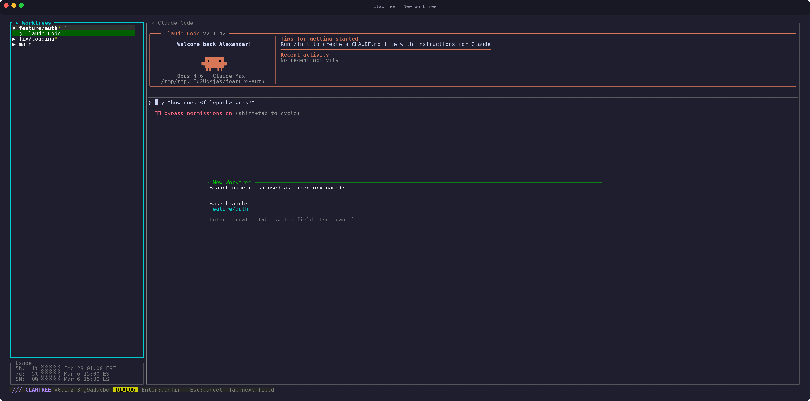

<div align="center">


<br>

**A terminal UI for managing git worktrees with integrated Claude Code sessions.**

[](https://github.com/Sorrer/ClawTree/releases/latest)
[](https://github.com/Sorrer/ClawTree/actions/workflows/release.yml)
[](https://www.rust-lang.org/)
[](#platform)

</div>

---

Built for the **bare repository** workflow where a project uses a `.bare/` directory with multiple worktree directories for different branches.


>Behind the Project:
>
>As I have been embracing AI assisted programming, I found myself pushing parallel AI development to the extreme.
>With this, I am stuck cloning repositories for different feature paths, and context swapping between multiple terminal tabs. All in the goal to utilize multiple claude instances and contextes to their fullest extent.
>This has been a rough process that I've been trying to optimize, and I think this has solved the issue for me.
>You should now be granted with the power of multi-clauding with this toolset!


## Table of Contents

- [Install](#install)
- [Getting Started](#getting-started)
- [Features](#features)
  - [Worktree Management](#worktree-management)
  - [Git Operations](#git-operations)
  - [Claude Code Sessions](#claude-code-sessions)
  - [Prompt Queue](#prompt-queue)
  - [Mini Mode (WIP)](#mini-mode-wip)
  - [Terminal & UI](#terminal--ui)
- [Requirements](#requirements)
- [Building from Source](#building-from-source)

## Install

```bash
curl -fsSL https://raw.githubusercontent.com/Sorrer/ClawTree/main/install.sh | bash
```

This downloads a pre-built binary for your platform and adds it to your PATH. Supports Linux (x86_64, aarch64) and macOS (Intel, Apple Silicon).

<details>
<summary><strong>Advanced install options</strong></summary>

Install from a **private repo** (requires [GitHub CLI](https://cli.github.com/) authenticated via `gh auth login`):

```bash
gh api repos/Sorrer/ClawTree/contents/install.sh \
  -H "Accept: application/vnd.github.raw" | GITHUB_TOKEN=$(gh auth token) bash
```

Install a specific version:

```bash
curl -fsSL https://raw.githubusercontent.com/Sorrer/ClawTree/main/install.sh | bash -s -- v0.1.0
```

Install to a custom directory:

```bash
CLAWTREE_INSTALL_DIR=/usr/local/bin curl -fsSL https://raw.githubusercontent.com/Sorrer/ClawTree/main/install.sh | bash
```

</details>

## Getting Started

After installation, point clawtree at a directory:

```bash
clawtree /path/to/your/project
```

If the directory does not contain a `.bare` repo layout, clawtree opens a **welcome screen** with setup options:

<p align="center">
  
</p>

From here you can:

- Press **`i`** to **initialize** a new bare repo workflow — creates the `.bare/` directory structure and your first worktree
- Press **`c`** to **convert** an existing regular git repo into the bare worktree layout (only shown when a `.git` directory is detected)

Once initialized, clawtree opens the main interface where you can browse your worktrees in the sidebar. Press **`n`** to create additional worktrees for new branches. To start a Claude Code session, press **`c`** for regular mode or **`C`** (Shift+C) for yolo mode (`--dangerously-skip-permissions`).

<p align="center">
  
</p>

## Features

### Worktree Management
- Browse, create, and delete git worktrees from a sidebar tree view
- Initialize new bare repos or clone from a remote URL
- Convert existing regular git repos to the bare worktree layout (in-place or to a new location)
- Background git status polling with per-worktree caching (auto-refreshes every 10s)

<p align="center">
  
</p>

### Git Operations
- Interactive file staging/unstaging (single file, stage all)
- Inline commit message input
- Branch merging with automatic dirty-worktree detection and pre-merge commit prompts
- Merge conflict resolution dialog — open in VS Code, JetBrains, Claude, or abort
- Push to remote with automatic upstream setup (`-u origin`)

<p align="center">
  
</p>

### Claude Code Sessions
- Spawn multiple concurrent Claude Code sessions per worktree
- tmux-backed sessions persist across TUI restarts with automatic reconnection
- Truecolor (24-bit RGB) passthrough configured automatically
- Full VT100 terminal emulation with 1000-line scrollback
- Session renaming/nicknames
- Optional `--dangerously-skip-permissions` mode

<p align="center">
  
</p>

### Prompt Queue
- Per-session prompt queues that auto-send when Claude is idle (5s cooldown)
- Add, edit, and delete queued prompts
- Queues persist to `.prompt_queues.json` and survive restarts

<p align="center">
  
</p>

### Mini Mode (WIP)

> **Note:** Mini Mode is a work in progress and may change significantly.

- Compact agent management view (toggle with F2)
- Drilldown into a single agent's terminal full-screen
- Agent status badges: Working, Idle, Needs Input, Exited
- Saved prompt templates (`.agent_prompts.json`) for quick agent creation
- Auto-captured agent summaries on Working-to-Idle transitions

### Terminal & UI
- Three screen modes: Normal, Mini, Mini Drilldown
- Keyboard-driven with vim-style navigation (j/k, Home/End, etc.)
- Mouse scroll support (3 lines per tick) with click-to-select text
- Scrollback browsing with scrollbar and `[+N]` offset indicator
- Context-sensitive help overlay with 6 tabs (press `?`)
- Status bar with auto-fading messages and mode badges
- Background Claude context usage tracking via debug log parsing

<p align="center">
  
</p>

### Platform
- Linux (x86_64, aarch64) and macOS (Intel, Apple Silicon)
- WSL integration: open Windows Terminal tabs with `w`/`W` keys
- Graceful signal handling (SIGINT, SIGTERM, SIGHUP) with guaranteed terminal restoration

## Requirements

| Dependency | Required | Purpose |
|---|---|---|
| **git** | Yes | Worktree management, staging, commits, merges |
| **claude** (Claude Code CLI) | Yes | AI assistant sessions spawned per worktree |
| **tmux** | Yes | Session persistence and reconnection across restarts |
| **wt.exe** | Optional | Windows Terminal tab integration (WSL only) |

## Building from Source

Everything from the requirements above, plus Rust (edition 2021, 1.56+) and a C compiler.

```bash
./build.sh
# or manually:
cargo build --release
```

```bash
./run.sh [optional-directory]
# or manually:
./target/release/clawtree [optional-directory]
```
